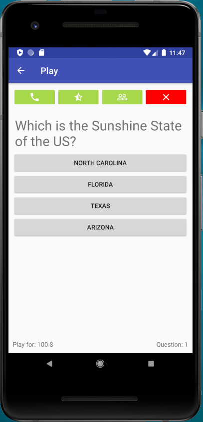

# SDM_Practices
(Developed during the CS Degree) An Android application reproducing the 'Who wants to be millonaire?' game.

# Introduction
The game obtains the questions using an API. The scores are stored in the device and the scores of other friends can be checked.

# Some user interfaces and videos

